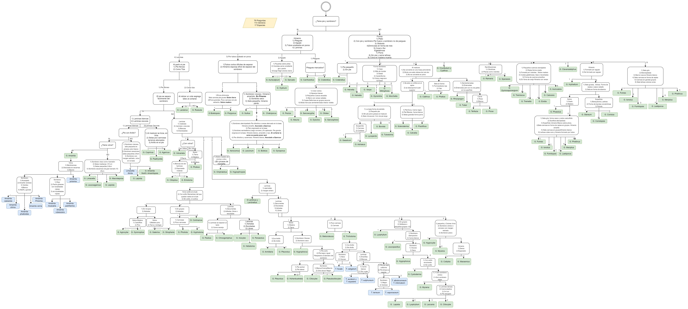

# Fellowship Fungi

FellowshipFungi es una aplicación de Android diseñada para la identificación de setas y gestión de encuentros con estas. La arquitectura de la aplicación sigue un modelo cliente-servidor, con un front-end desarrollado en Android y un back-end basado en Firebase. Este README proporciona una guía paso a paso para replicar el proyecto.

## Tabla de Contenidos

- [Características](#características)
- [Requisitos Previos](#requisitos-previos)
- [Instalación](#instalación)
- [Estructura del Proyecto](#estructura-del-proyecto)
- [Configuración de Firebase](#configuración-de-firebase)
- [Uso](#uso)


## Características

- Identificación de setas mediante un sistema de preguntas.
- Gestión de perfiles de usuario.
- Registro de encuentros con setas.
- Visualización de curiosidades diarias sobre setas.
- Test de conocimientos sobre setas.
- Autenticación mediante correo, Google y teléfono.

## Requisitos Previos

- Android Studio instalado.
- Cuenta de Firebase.
- Conexión a Internet.

## Instalación

1. Clonar el repositorio:

   ```bash
   git clone https://github.com/bm0631/FellowShipFungi
   ```
2. Abrir el proyecto en Android Studio.

3. Configurar Firebase en tu proyecto de Android:

- Crear un nuevo proyecto en Firebase Console.
- Registrar la aplicación de Android en Firebase.
- Descargar el archivo `google-services.json` y colocarlo en el directorio `app` de tu proyecto.
- Activar los servicios de Firestore Database, Authentication y Storage en Firebase.
- Sincronizar el proyecto con Gradle.

## Estructura del Proyecto

La estructura del proyecto se organiza en paquetes según su funcionalidad:

- **Miw.fellowshipfungi**: Paquete raíz del proyecto.
- **Models**: Modelos de datos.
  - **Models.profile**: Modelos del perfil de usuario.
  - **Models.Ask**: Modelos de preguntas (test y reconocimiento de setas).
  - **Models.Recognitionmodels**: Modelos concretos del reconocimiento de setas.
- **Controllers**: Controladores de Activity de cada vista.
  - **Controllers.Dialogs**: Paneles emergentes auxiliares usados por los controladores.
  - **Controllers.Adapters**: Adaptadores para rellenar vistas tipo RecyclerView.
  - **Controllers.Services**: Servicios que ofrecen persistencia de datos a los controladores.

### Tipos de Clases en el Front-End

- **Modelos**: Representan los datos y las estructuras que maneja la aplicación.
- **Actividades y Fragmentos**: Representan las pantallas y partes reutilizables de la interfaz de usuario.
- **Servicios**: Clases que se ejecutan en segundo plano para realizar operaciones con persistencia, como descargas o subidas de datos.
- **Adaptadores**: Clases que gestionan y muestran colecciones de datos en componentes de la interfaz, como listas.
- **Interfaces para Callbacks**: Manejan eventos asíncronos y devuelven resultados de operaciones, como respuestas a solicitudes.

## Configuración de Firebase

El Back-End se basa en los tres servicios de Firebase que usaremos: Firestore Database, Authentication y Storage.

### Firestore Database

Guarda el árbol de decisión para identificar setas, el perfil de cada usuario, la colección de cada usuario, las preguntas del test y las curiosidades diarias. Las tablas de la base de datos se presentan en una estructura JSON, a pesar de usar un modelo NoSQL.

Si quiere replicarse exactamente el diseñado original hay que meter este [JSON](DB/BD.json) en la BD, para importación se ha usado https://www.npmjs.com/package/node-firestore-import-export 

#### Clave Dicotómica/Árbol de Decisión

La fuente de datos para diseñar este árbol es la transcripción del libro “Clave Dicotómica para Principiantes” adaptado para la Sierra Norte por varios autores. Este árbol se ha implementado parcialmente hasta el nivel de género.


#### Perfil de Usuario y Colección

Diseño de la estructura de datos para almacenar la información del perfil de usuario y sus colecciones de setas.

#### Test

Estructura para guardar las preguntas y respuestas del test de conocimientos sobre setas.

#### Curiosidades Diarias

Estructura para almacenar y presentar curiosidades diarias sobre setas a los usuarios.

### Authentication

Se habilitarán los métodos de acceso mediante correo, Google y teléfono para autenticar a los usuarios.

## Uso

1. Iniciar la aplicación en un dispositivo Android o emulador.
2. Registrarse o iniciar sesión (o no) mediante uno de los métodos de autenticación.
3. Explorar las funcionalidades de la aplicación, como el reconocimiento de setas, gestión de encuentros y visualización de curiosidades diarias.

